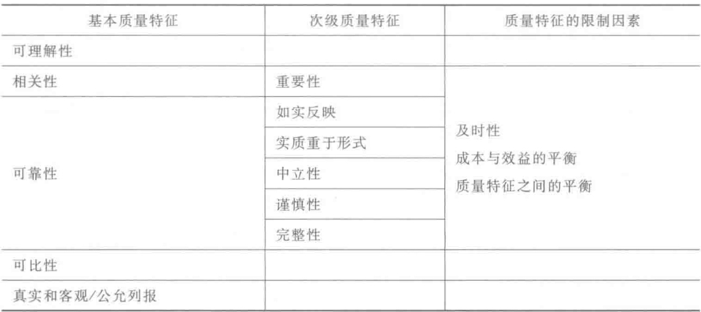

  

表1-2 《框架》（1989）的财务信息质量特征  

  

国际会计准则理事会和美国财务会计准则委员会于2010年发布的《财务会计概念框架》（2010）[以下简称《概念框架》（2010）]中，对财务信息质量特征进行了修订，我国尚未引人该部分修订。修订后的财务信息质量特征如表1一3所示。  

表1-3 《概念框架》（2010）的财务信息质量特征  

  

《概念框架》（2010）把质量特征划分为基本质量特征（Fundamentalquali-tativecharacteristics）和优化质量特征（Enhancingqualitativecharacteristics）两个层级。基本质量特征是达到财务报告目标的必要质量特征，只要满足基本质  

  
